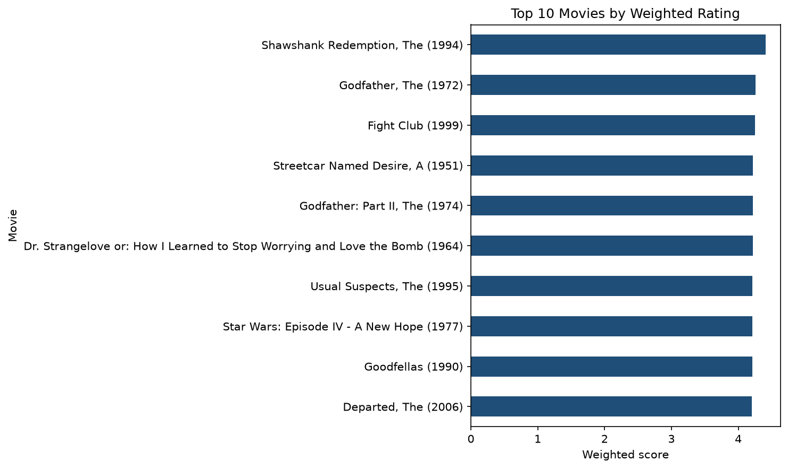

## Student 
 Name: Amy Njenga 
 Student number: 668698
 
 ## Project overview 
 This project explores MovieLens user-item ratings and builds two non-personalized movie recommendation baselines. 
 ## Dataset MovieLens latest-small from GroupLens. 
 https://grouplens.org/datasets/movielens/, 
 files used: movies csv and ratings csv, date accessed: 21/09/2026
  ## Methods 
  ### 1. Rating-count and average-rating exploration 
  ### 2. Minimum-rating popularity baseline 
  ### 3. Weighted-rating baseline 

  ## How to run 
  1. Clone the repository 
  2. Install packages: `pip install -r requirements.txt` 
  3. Place the required CSV files in `data/` if they are omitted 
  4. Open `notebooks/week1_popularity_recommender.ipynb` 
  5. Run all cells from top to bottom

  ## Key findings 
  
  It is possible to create a **ranked list of recommended movies** by making use of the **rating count** and the **average rating** of all the movies in the dataset. Though this method collapses all users into a single figure. This baseline then makes it possible to output lists of popular movies based on their average rating.
  
  Some movies had low rating counts which would overstate the rating given. This then led to the use of a **minimum threshold** which ensures that only movies with a certain number of ratings can be considered for the list. 
  
  Further a **weighted score** can be calculated to output a more context-rich list of popular and highly rated movies.
  
  From our dataset the top 10 movies consistently included **Shawshank Redemption, The Godfather and Fight Club** which is unsurprising as these are considered cult classics. 
  
  It is worth noting that the ratings were unevenly distributed with majority of observations on the higher side than the lower side. This does indicate that users in general, rate movies higher.
   
  ## Limitations 

  While the use of a weighted score is helpful, this still has a few limitations:
  - The cold-start problem: This method fails to account for movies with no ratings on a platform
  - Bias towards older movies: This method supports movies with a high number of ratings, this then means that movies that have existed longer in the industry are more likely to be ranked higher
  - Bias toward mass appeal: This method is more likely to recommend movies with higher ratings which may not be a reliable indicator of whether a specific user will enjoy it
  - Failure to consider personal taste: This method flattens all the users into the rating values which then result in the same ranked list being pushed to every user failing to consider their preference, demographic, age, language etc.
    
  ## Repository structure 
 dsa4060-week1-recommender/
 
├── data/

│ ├── movies.csv

│ └── ratings.csv

├── images/

│ └── top10_recommendations.png

├── notebooks/

│ └── week1_popularity_recommender.ipynb

├── .gitignore

├── README.md

└── requirements.txt

  ## Screenshot 
